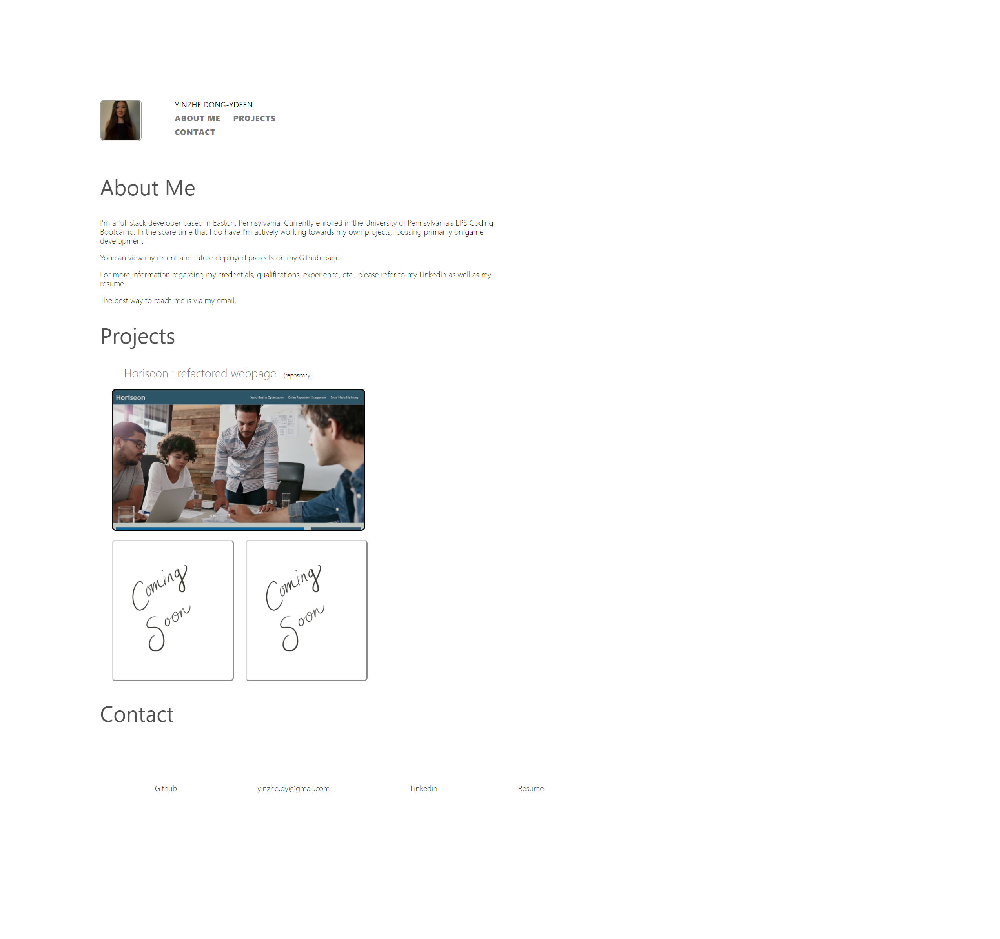
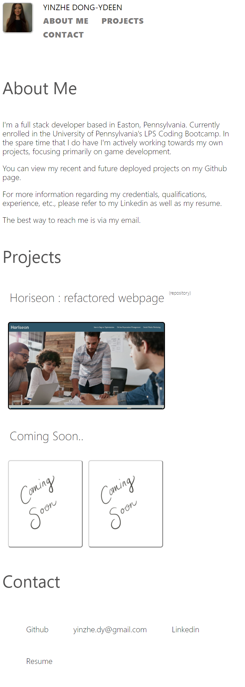

# 02-Homework-responsive-portfolio

# <Homework-Responsive-Portfolio>
## Description

- My motivation for this project was to create a functional porfolio web page. I included a navbar with links to scroll down to corresponding sections, as well as direct links at the bottom of the page to direct potential employers, or viewers, to my contact information, resume, and pages relating to my work. Key words within the "About Me" section also serve as quick links, while reading, to corresponding information/pages. I wanted to create a user interface that was pleasant, simple, and straightforward, while still ensuring all necessary information was present for further exploration and inspection. I ensured that my primary project example and section titles were larger in contrast to the rest of the page in order to facilitate effiecient navigation as well. I also included a media query in my css to adjust the sizing of fonts, images, and margins when viewing on smaller (mobile) screens.

## Table of Contents (Optional)
If your README is long, add a table of contents to make it easy for users to find what they need.
- [Installation](#installation)
- [Link](#link)
- [Screenshot](#screenshot)
- [Credits](#credits)
- [License](#license)
## Installation
Ensure to link the style.css file within the index.html file in order to apply styling to the presented html code when viewing in browser. Make sure that index.html and assets folder are siblings of one another within the project folder. Next recheck that the css folder, containing style.css, and images folder, containing the jpg and png files, are siblings of one another within the assets folder.

## Link
Link to deployed application:

https://yinzhedy.github.io/02-Homework-responsive-portfolio/

## Sceenshots

The following image demonstrates the web application's appearance and functionality when viewed in fullscreen:

The following image demonstrates the web application's appearance and functionality when viewed on 800px width, smaller/mobile, screens.

## Credits
- Jack H. Ault
- https://github.com/henlowgg
## License
Unlicensed

## How to Contribute
Any requests for contribution please contact at yinzhe.dy@gmail.com

